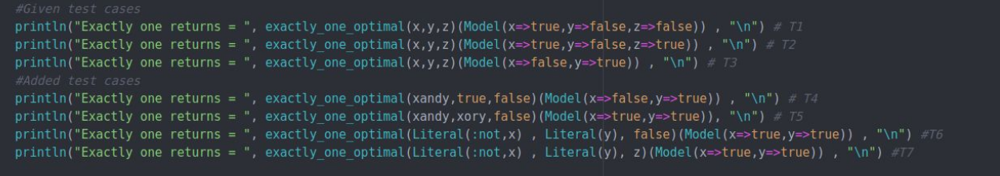
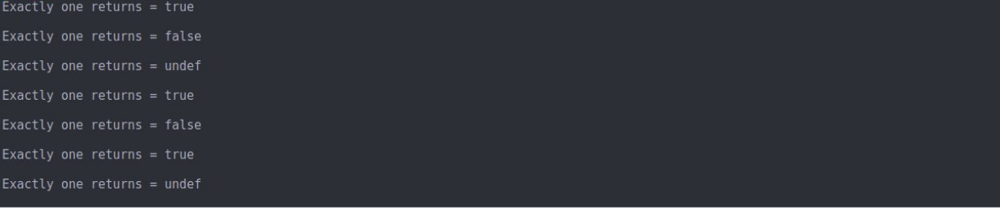
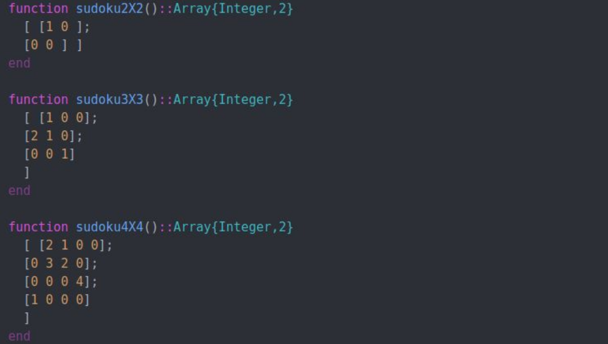
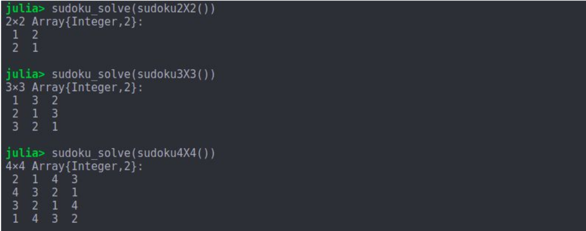
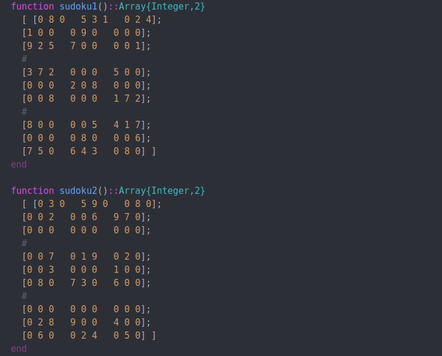
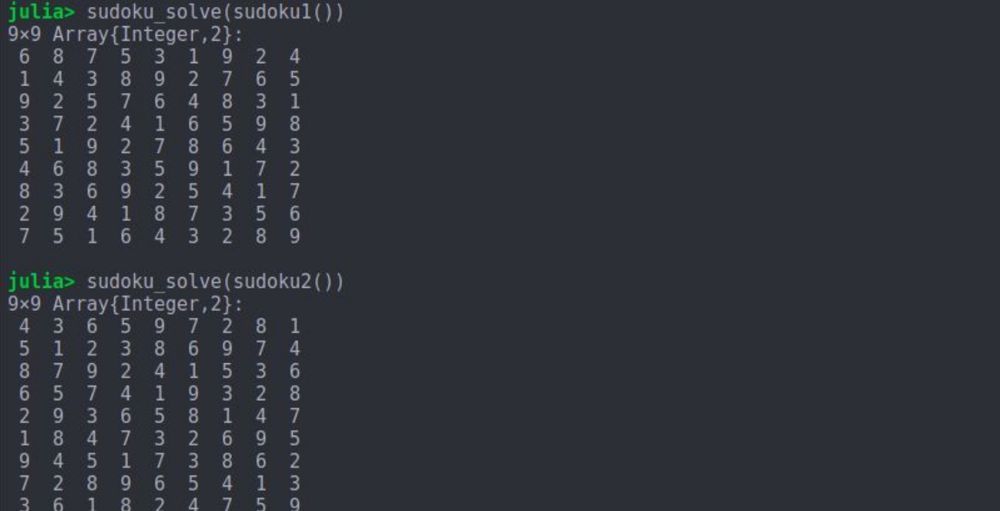

# Sudoku-Solver
Sudoku-Solver has two components:

#### Exactly One
**Function:** 
```exactly_one(args...)``` that takes one more arguments. Each argument should be of type  Bool, SymBool, Literal, or Variable. Lets call them ```a1, a2, . . . . ``` 

**Output:**  ```exactly_one(args...)``` returns true if exactly one of ```a1, a2, . . .``` is true.



For CNF representation
```python
print(cnf(clausify(exactly_one(x, y, z)).clauses))
```
#### Sudoku
A Sudoku puzzle is represented as a N × N array of integers. To describe a puzzle, 0 indicates a blank square, and the integers 1 though 9 represent squares filled with that value.
**Function:**
```sudoku_solve(puzzle::Array{Integer,2})::Union{Array{Integer,2},UnSAT}``` returns a N × N array of integers if the puzzle is solvable – this should be a solution to the puzzle. If the puzzle is unsolvable, return UnSAT.
**Input**

**Outupt**


**Input: 9x9 test cases**

**Outupt**


 This work is a part of CPSC 513 Homework 1